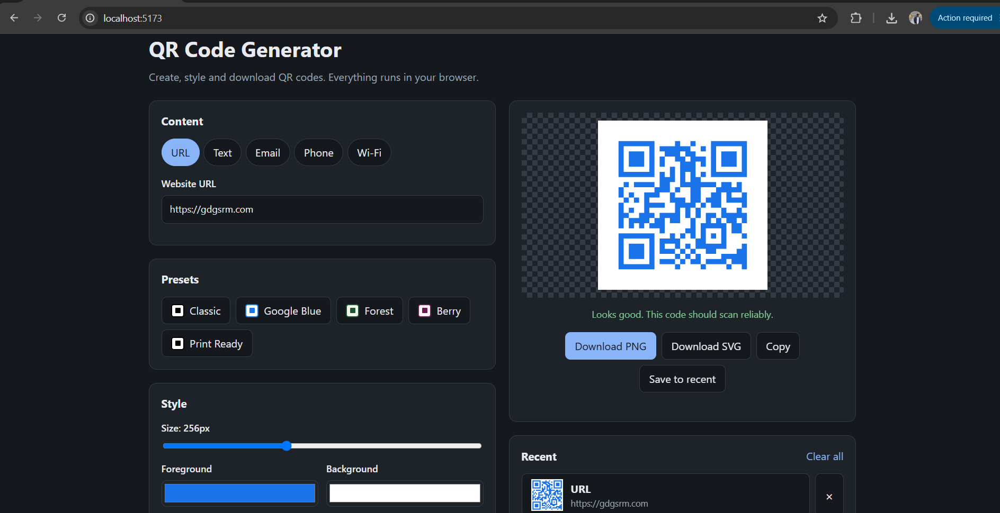
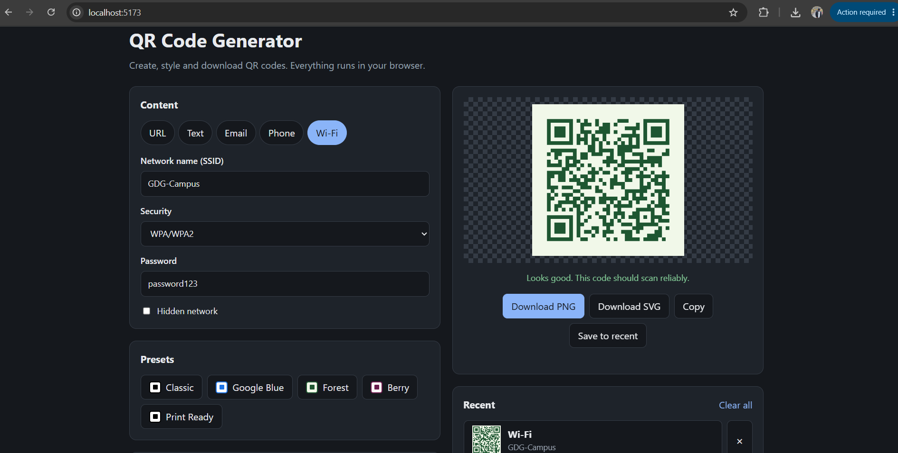
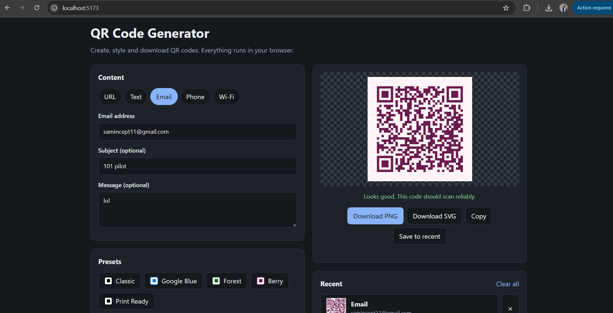
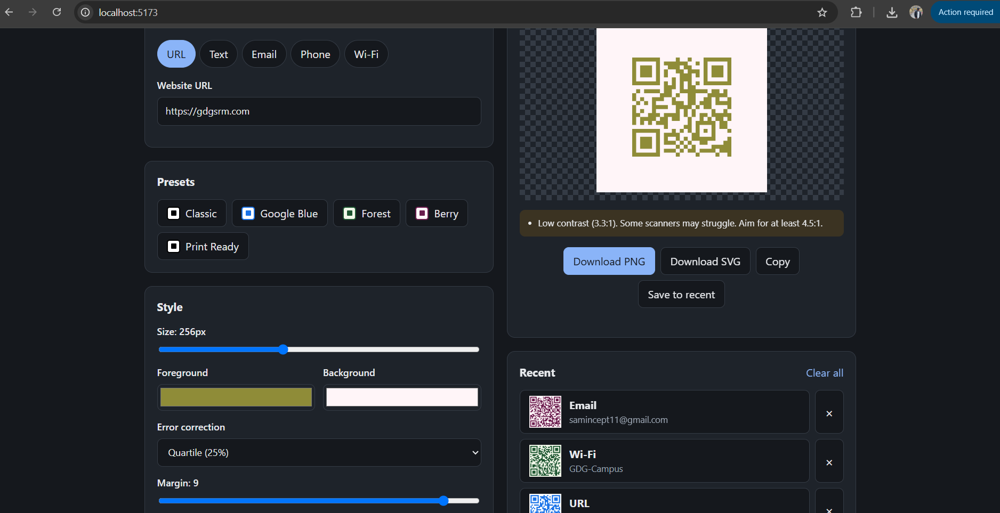
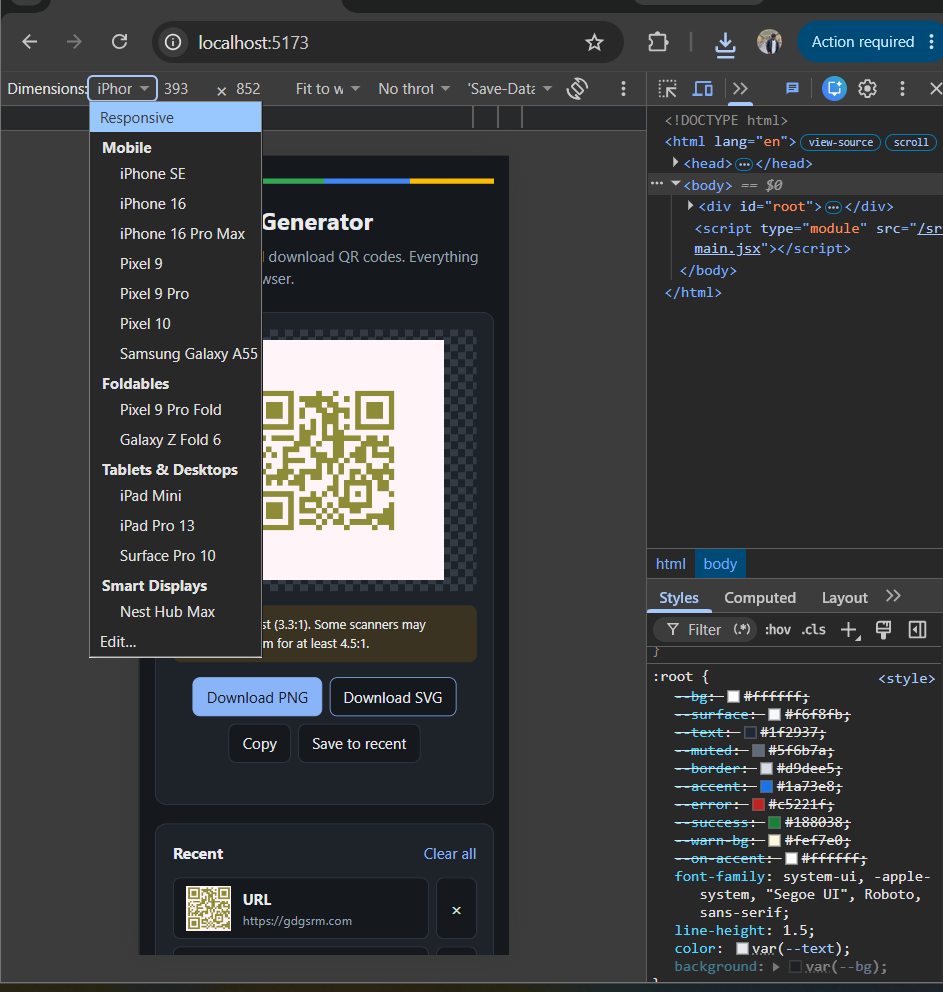

# QR Code Generator & Designer

A web app to generate, customize, and download QR codes. It runs entirely in the browser with no backend.

Built for the **GDG on Campus SRM Recruitments 2026-27 (Technical Domain – Frontend Task 1)**.

**Live demo:** LIVE-LINK-HERE

## Screenshots

### Desktop


### Wi-Fi QR code


### Input validation


### Scan reliability warnings


### Mobile


## Features

**QR generation**
- Live preview that updates as you type
- 5 QR types, each with its own input fields: URL, Plain Text, Email (address, subject, message), Phone Number, and Wi-Fi (network name, password, security type, hidden network)

**Customization**
- Size (96–512 px), foreground and background colors, error correction level (L/M/Q/H), and margin
- 5 presets (Classic, Google Blue, Forest, Berry, Print Ready); settings can still be changed after picking a preset
- Reset style button

**Validation**
- URLs must be valid and start with http:// or https://
- Email addresses must be in a valid format
- Phone numbers must have 7–15 digits (optional +)
- Wi-Fi requires a network name, and WPA passwords must be at least 8 characters
- Clear error messages, and no QR code is generated for invalid input

**Scan reliability warnings**
- Low contrast between foreground and background (uses the WCAG contrast ratio formula)
- Inverted colors (foreground lighter than background)
- Margin below the recommended 4 modules (the "quiet zone")
- Very small size, or a lot of data in a small code

**Download and sharing**
- Download as PNG (rendered from the same canvas as the preview, so it matches exactly)
- Download as SVG (optional enhancement)
- Copy QR image to clipboard (optional enhancement)

**Recent QR codes**
- Downloaded or saved codes are stored in `localStorage`, so they remain after a page refresh
- Click a recent code to load its content and style again; delete individual items or clear all
- Keeps the 8 most recent codes and avoids duplicates

**Design**
- Responsive layout: two columns on desktop, single column on mobile with the preview first
- Automatic dark/light theme based on system settings (optional enhancement)
- Keyboard focus outlines for accessibility

## Tech Stack

- React (with Vite)
- JavaScript, HTML, CSS
- [qrcode.react](https://github.com/zpao/qrcode.react) for QR code rendering
- localStorage for persistence
- Vercel for deployment

## How It Works

**QR content formats.** Each type is converted into the text format that phone scanners understand:

| Type | Format |
|---|---|
| URL | `https://example.com` |
| Text | the text as-is |
| Email | `mailto:name@example.com?subject=...&body=...` |
| Phone | `tel:+919876543210` |
| Wi-Fi | `WIFI:T:WPA;S:NetworkName;P:password;;` (special characters `\ ; , : "` are escaped) |

**State.** The selected type, form data, and style settings are stored with React's `useState`. Every change re-renders the preview immediately.

**Error correction.** Higher levels (Q, H) let the code still scan when part of it is damaged or covered, at the cost of a denser pattern.

**Persistence.** The recent list is saved to `localStorage` whenever it changes and loaded when the app starts. Storage errors are caught so the app still works if storage is blocked.

## Run Locally

```bash
git clone https://github.com/sonuseervi101/qr-code-generator.git
cd qr-code-generator
npm install
npm run dev
```

Then open http://localhost:5173

## Testing

Tested manually:
- All 5 QR types generated and scanned with a phone camera (URL opens the site, Email opens a draft, Phone opens the dialer, Wi-Fi offers to join the network)
- All customization options and presets update the preview immediately
- Downloaded PNG files open correctly and match the preview
- Invalid inputs (bad email, short phone number, short WPA password, empty fields) show errors
- Recent codes remain after refreshing the page and can be reloaded and deleted
- Layout checked on desktop and mobile sizes using Chrome DevTools

## Author

Sonu – [GitHub](https://github.com/sonuseervi101)